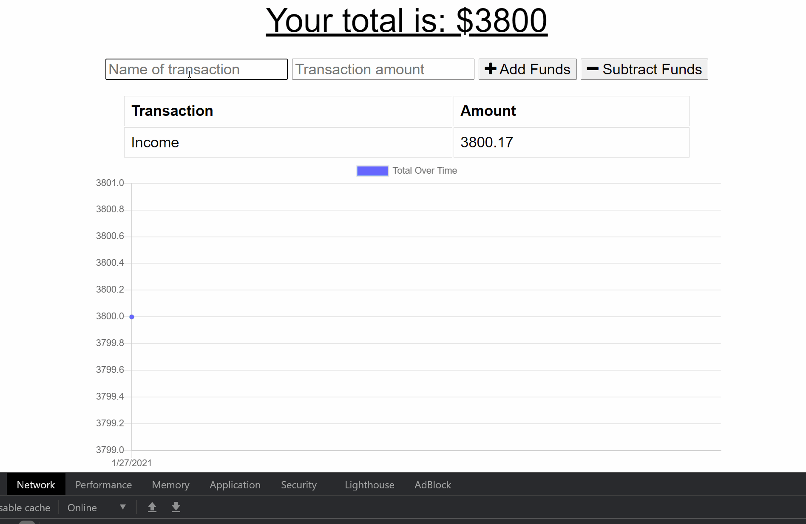

# PWA-Budget-App

The potential of PWAs is what inspired me to attend school for web development. This application is a budget tracker to demonstrate offline PWA functionality. Users are able to add and subtract funds from their budget from any device. When offline, the app will still function as intended and data will automatically sync when online again. 

## Table of Contents

- [Objective](#Objective)
- [Outcome](#Outcome)
- [Technology](#Technology)

## Objective

- Configure a full stack web application
- Write API routes to access a mongo database
- Configure a service worker and web manifest to utilize an offline and installable PWA

[PWA Budget Tracker](https://budget-pwaa.herokuapp.com/) is hosted on Heroku.

## Outcome

This application was a lot of fun to work on. Managing the data while offline and then updating the database when connection was re-established was tricker but was very cool to witness working!

## Technology

| | | |
| ------ | ------ | ------ |
| [compression](https://github.com/expressjs/compression#readme) | [Bootstrap Framework](https://getbootstrap.com/docs/5.0/getting-started/introduction/) | [express](http://expressjs.com/) |
| [jquery](https://jquery.com/) | [light-server](https://github.com/johnpapa/lite-server#readme) |[mongoose](https://mongoosejs.com/) |
| [morgan](https://github.com/expressjs/morgan#readme)

This application was authored by [Diego Hernandez](https://github.com/Diegopie)
