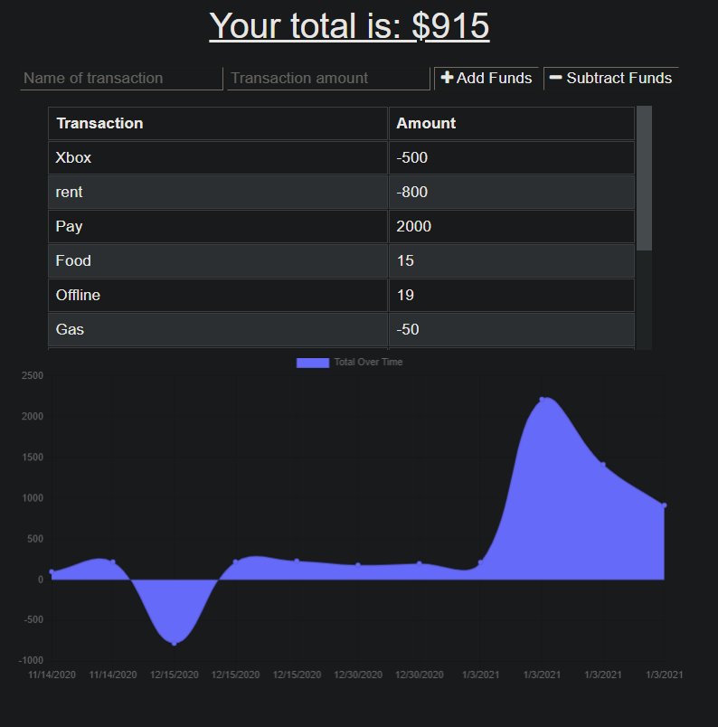

# PWA-Budget-App

The potential of PWAs is what inspired me to attend school for web development. This application is a simple budget tracker to demonstrate offline web app functionality.

## Objective

- Configure a full stack web application
- Write API routes to access a mongo database
- Configure a service worker and web manifest to utilize an offline and installable PWA

[PWA Budget Tracker](https://budget-pwaa.herokuapp.com/) is hosted on Heroku.

## Outcome

This application was a lot of fun to work on. Managing the data while offline and then updating the database when connection was re-established was tricker but was very cool to witness working!

## Technology

This application relies on FontAwesome Express, and Mongoose

This application was authored by [Diego Hernandez](https://github.com/Diegopie)
